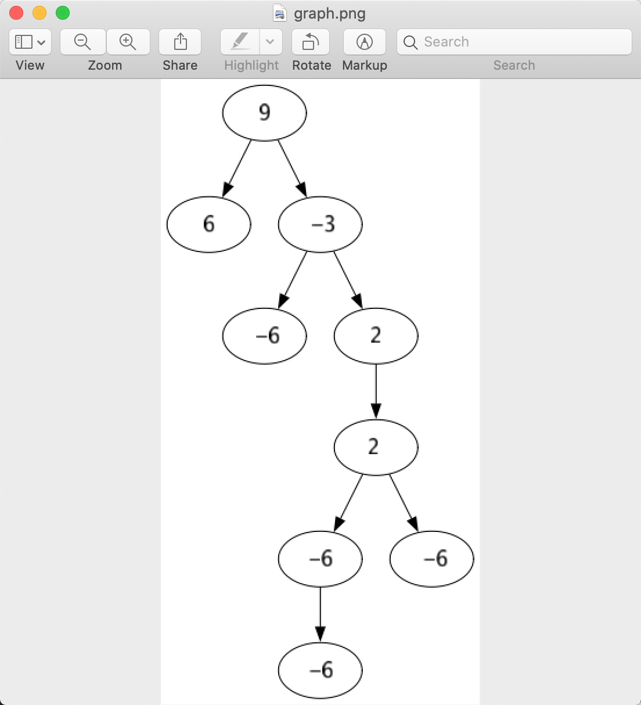
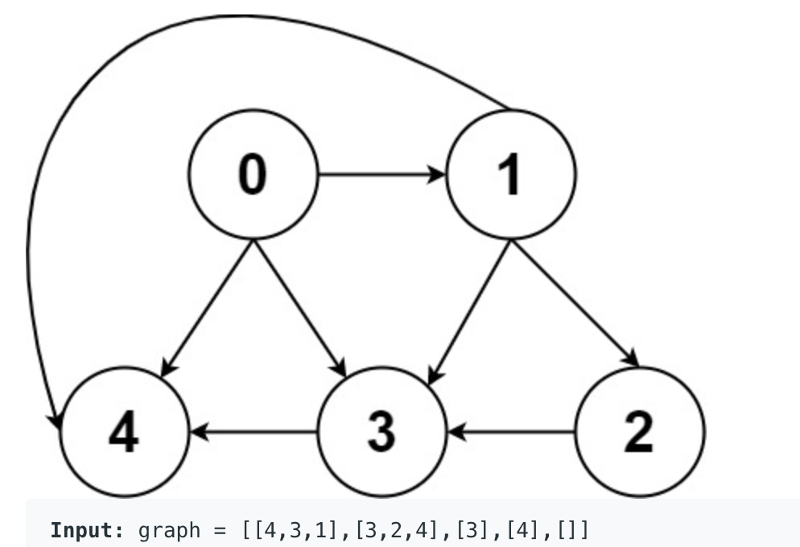
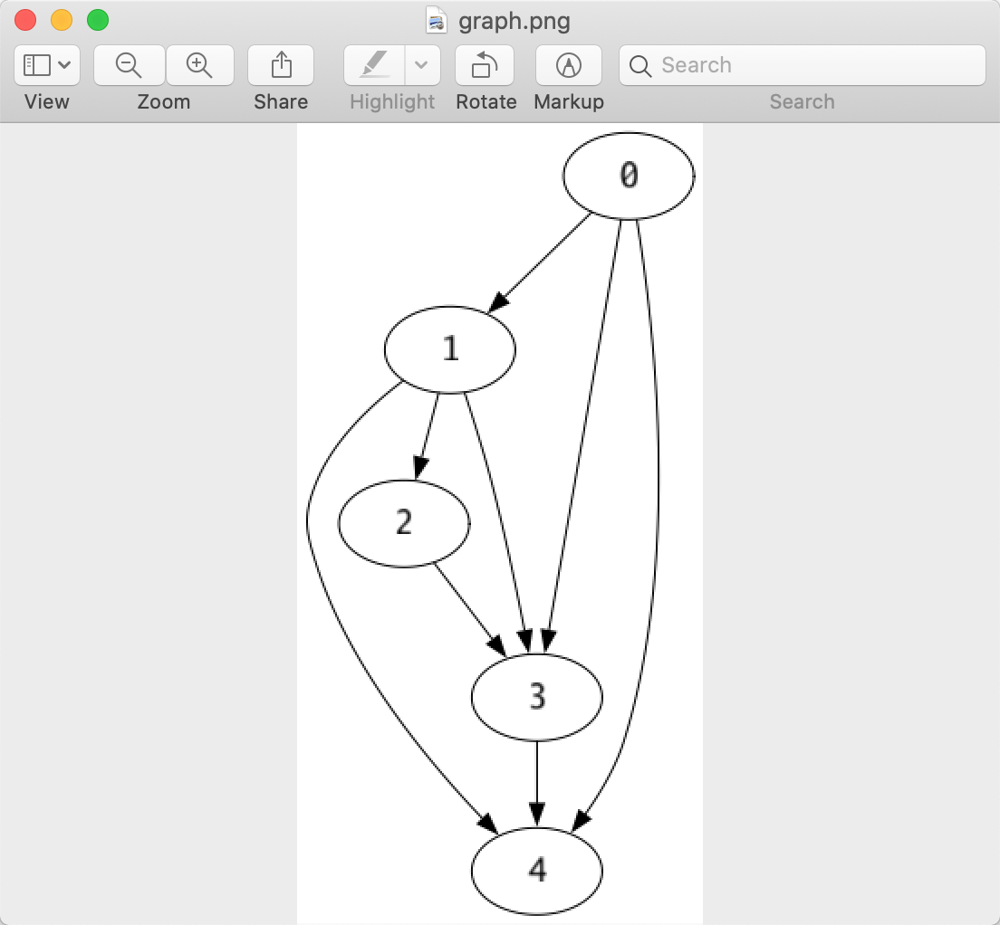
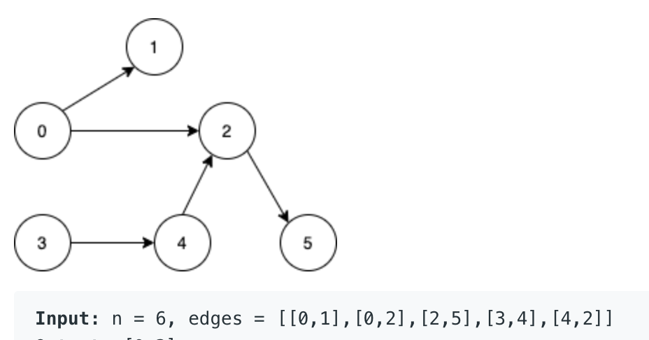
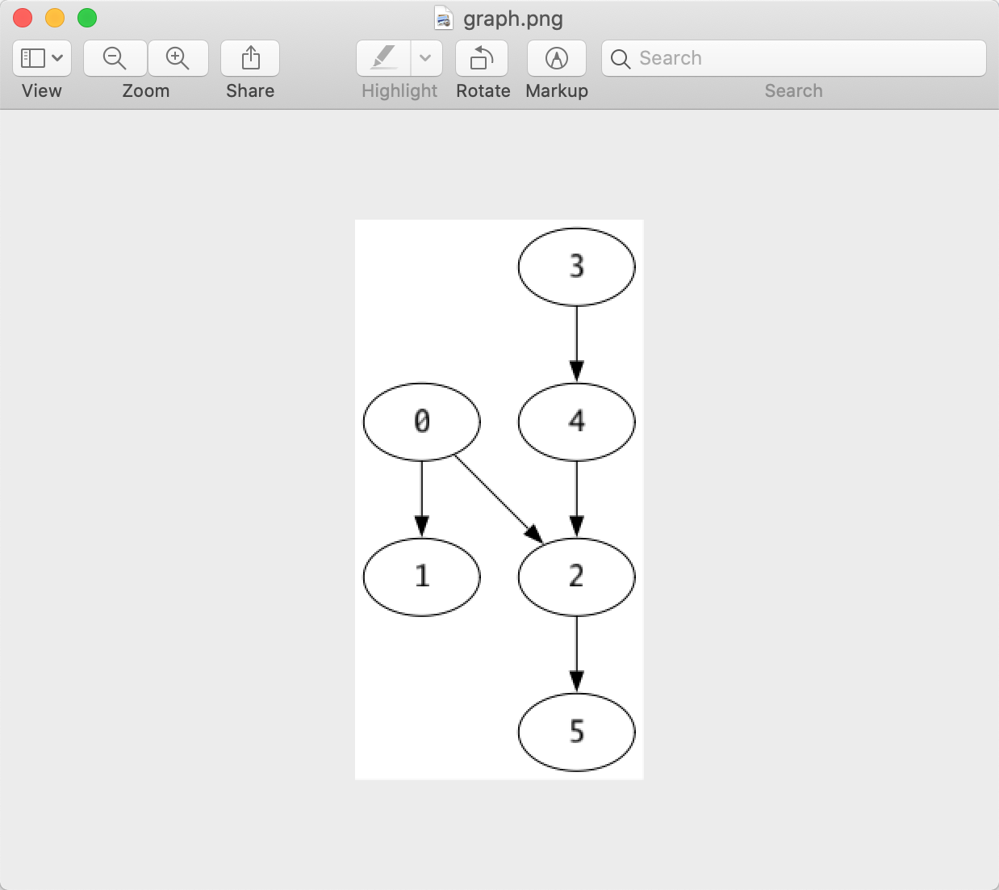

# leetcode-helper(by golang)

[中文版](./README_CN.md)

this library helps you with:

- convert problem's input to golang data structure which used by leetcode
- display some data structure by leetcode problem's input(string)

now only `linked list`, `binary tree`, `graph`, `int array`, `int matrix` are supported

## story

i prefer using IDE(goland) to solve leetcode problems, you can debug your code easily,

leetcode will provide some test cases which consists of input and output,

so we can use these test cases to test our code.

also, when our submission failed, leetcode will be kind to provide the corresponding input and output of the test case.

but the leetcode problem input is just a string,

for example: `[9,6,-3,null,null,-6,2,null,null,2,null,-6,-6,-6]`, this input represents a tree,

it's hard for us to know what's the tree looks like, 

so i write this library, with it's help you can convert the input to golang data structure to test your code

and display what does it look like.


## Tree

leetcode use a json array as input to represent a tree,

it's hard for us to read the tree.

with the helper, you can turn the input to a readable one,

there are two way to display tree:


### print in console

for example:

```go
func TestPrintTree(t *testing.T) {
	input := `[9,6,-3,null,null,-6,2,null,null,2,null,-6,-6,-6]`
	tree := ParseTreeFromInput(input)
	PrintTree(``, tree)
}
```

the function `GetTreeFromInput` turn the input to a tree,

and the func `PrintTree` will print the tree in text

the following is the printed tree:

```
         |-- 2
                 |-- -6
             |-- 2
                 |-- -6
                     |-- -6
     |-- -3
         |-- -6
 |-- 9
     |-- 6
```

the root is at the left most place, the left child locate blow the parent, 

the right child locate above the parent.

so the root is `9`, it's left child is `6`, it's right child is `-3`

for the node `-3`, it's right child is `2`

### rendered in pictures

for example:

```go

func TestRenderTree(t *testing.T) {
	input := `[9,6,-3,null,null,-6,2,null,null,2,null,-6,-6,-6]`
	tree := ParseTreeFromInput(input)
	RenderTree(tree)
}
```

`RenderTree` will pop up window:




## LinkedList

the example code:

```go
func TestLinkedList(t *testing.T) {
	input := `1,2,3,4,5,6`
	head := ParseLinkedListFromStr(input)
	// get int linked list instead of string
	//head := GetIntLinkedListFromStr(input)
	PrintLinkedListNode(head)
}
```

the output is 
```
1->2->3->4->5->6->
```


## Graph

for now, i met two types of input string to represent graph:

### input represent graph


for example: 




example code:

```go
func TestGraph(t *testing.T) {
	input := `[[4,3,1],[3,2,4],[3],[4],[]]`
	graph := ParseGraphInput(input)
	RenderGraph(graph)
}
```
RenderGraph will pop up a window  displaying the graph(only tested on mac):



### input represent edges

for example:



example code:

```go
func TestGraphEdges(t *testing.T) {
	input := `[[0,1],[0,2],[2,5],[3,4],[4,2]]`
	edges := ParseEdgesInput(input)
	RenderGraphByEdges(edges)
}
```

rendered graph:




### render graph implemented by map[int][]int


if you use map[int][]int as a map, you can render it with func : `RenderGraphByEdgesMap`


## int matrix

example:

```go
func TestIntMatrix(t *testing.T) {
	input := `[[0,0,1,1],[1,0,1,0],[1,1,0,0]]`
	matrix := ParseIntMatrix(input)
	PrintIntMatrix(matrix)
}
```

the output is ：

```text
[0 0 1 1]
[1 0 1 0]
[1 1 0 0]
```

## int array

example：

```go

func TestIntArray(t *testing.T){
    input := `[0,0,1,1]`
    ParseIntSlice(input)
}
```