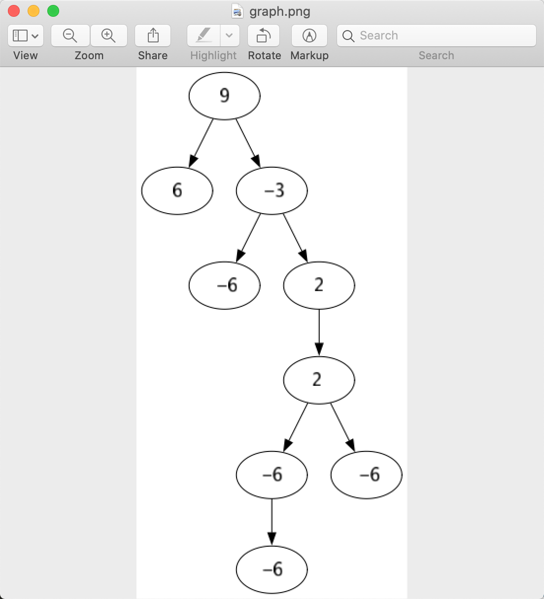
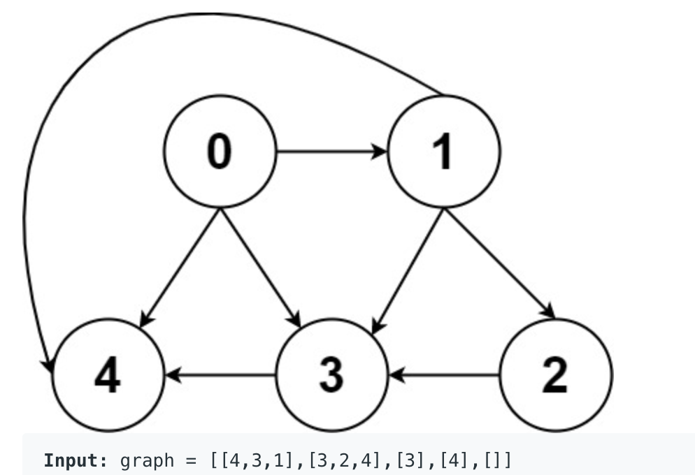
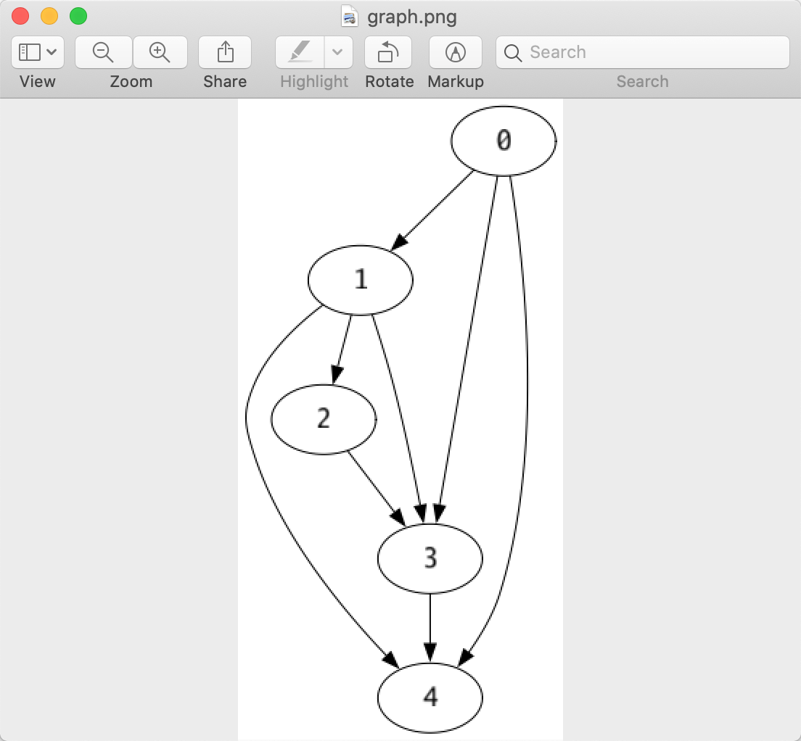
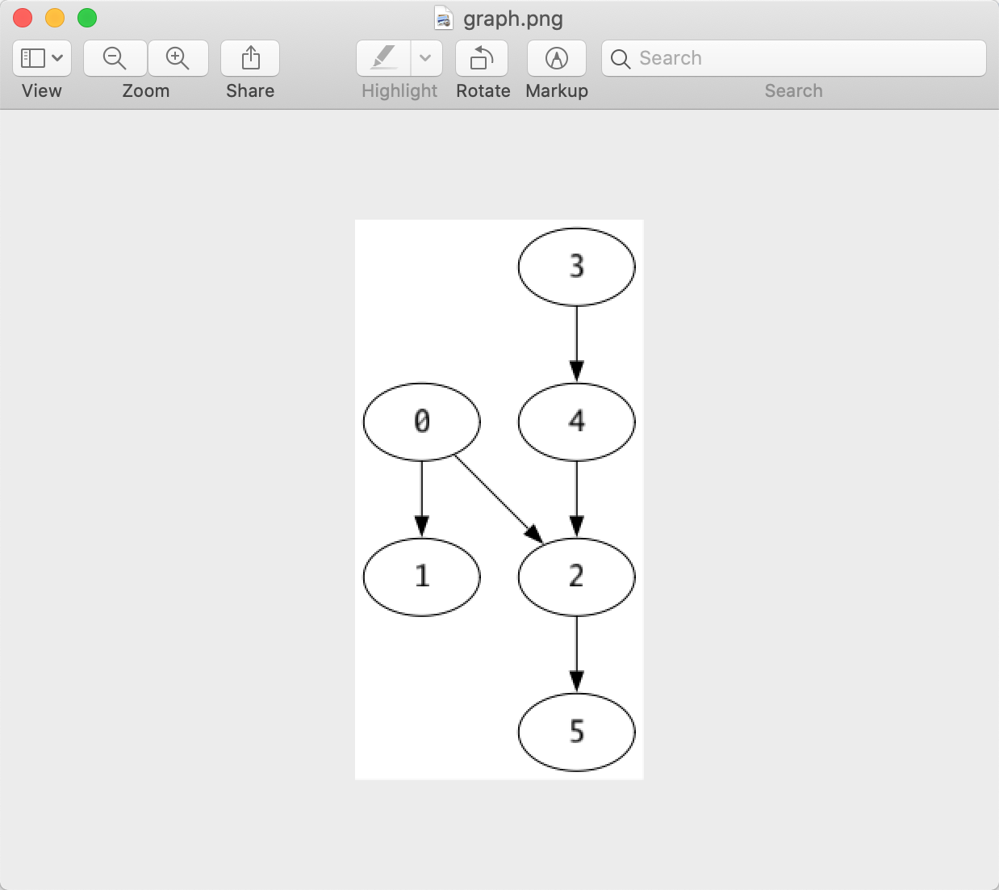

# leetcode-helper(by golang)

[English Version](./README.md)

这个库可以帮您：

- 将题目的输入转换成leetcode采用的golang数据结构。
- 将leetcode题目的输入的对应数据结构展示出来。

现在只支持了 `linked list`, `binary tree`, `graph` , `int array`, `int matrix`

## 故事

我一般喜欢用IDE(goland)去写leetcode题目，更加高效，更好调试。

一般leetcode会给几个例子（输入输出）来补充说明题目，这些例子可以拿来当作测试用例来测试我们写的代码，

另外当我们提交代码时，leetcode准备了很多测试用例来测试我们的代码，

当某个用例失败了的时候，它还会贴心地提醒我们当前测试用例的输入输出。

但是呢，这些输入都是一段字符串，比如`[9,6,-3,null,null,-6,2,null,null,2,null,-6,-6,-6]`表示了一棵树，

我们很难从这段字符串看出这棵树长什么样。

所以我写了这个库，用来查看当前输入对应的数据长什么样的，还可以直接基于转换后的数据来测试我们的代码。


## Tree

leetcode使用json数组来表示一棵树，

leetcode-helper提供了两种方式来展示这棵树：


### 在终端打印

代码例子：

```go
func TestPrintTree(t *testing.T) {
	input := `[9,6,-3,null,null,-6,2,null,null,2,null,-6,-6,-6]`
	tree := ParseTreeFromInput(input)
	PrintTree(``, tree)
}
```


 `GetTreeFromInput` 方法将输入字符串转换成一棵树，
 

`PrintTree` 将打印这棵树

下面是打印出的树：

```
         |-- 2
                 |-- -6
             |-- 2
                 |-- -6
                     |-- -6
     |-- -3
         |-- -6
 |-- 9
     |-- 6
```

root在左下角，左子树在父节点的下边，右子树在父节点的上方，

在上图中，`9`是root，它的左子节点是`6`, 右子节点是`-3`

`-3`的右子节点是2，在最上方


### 以图片形式渲染

代码示例：

```go

func TestRenderTree(t *testing.T) {
	input := `[9,6,-3,null,null,-6,2,null,null,2,null,-6,-6,-6]`
	tree := ParseTreeFromInput(input)
	RenderTree(tree)
}
```

`RenderTree` 将会弹出一个窗口，展示这棵树（只在mac上测试过）：




## LinkedList

代码示例：

```go
func TestLinkedList(t *testing.T) {
	input := `1,2,3,4,5,6`
	head := ParseLinkedListFromStr(input)
	// get int linked list instead of string
	//head := GetIntLinkedListFromStr(input)
	PrintLinkedListNode(head)
}
```
`ParseLinkedListFromStr`将输入字符串转换成golang数据结构。

输出是
```
1->2->3->4->5->6->
```


## Graph

我现在只刷了3到graph的题，目前为止遇到了两种输入：

### input为一棵树：


例如：



代码示例：

```go
func TestGraph(t *testing.T) {
	input := `[[4,3,1],[3,2,4],[3],[4],[]]`
	graph := ParseGraphInput(input)
	RenderGraph(graph)
}
```
`RenderGraph` 会弹出一个窗口展示这个图



### 输入为edge列表

例如：


代码示例：

```go
func TestGraphEdges(t *testing.T) {
	input := `[[0,1],[0,2],[2,5],[3,4],[4,2]]`
	edges := ParseEdgesInput(input)
	RenderGraphByEdges(edges)
}
```

弹窗展示的图：




### 渲染 map[int][]int实现的图

如果您使用map[int][]int实现图，可以使用方法 `RenderGraphByEdgesMap`来渲染。


## int matrix

代码示例:

```go
func TestIntMatrix(t *testing.T) {
	input := `[[0,0,1,1],[1,0,1,0],[1,1,0,0]]`
	matrix := ParseIntMatrix(input)
	PrintIntMatrix(matrix)
}
```

打印效果：

```text
[0 0 1 1]
[1 0 1 0]
[1 1 0 0]
```

## int array

代码示例：

```go

func TestIntArray(t *testing.T){
    input := `[0,0,1,1]`
    ParseIntSlice(input)
}
```

